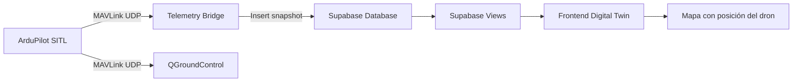

# Report General Epic 1 (28 de enero - 1 de marzo)

## Información

| Campo | Valor |
|-------|-------|
| **Proyecto** | GTI Digital Twin — Visualización de Drones |
| **Mes** | #1 (Fecha: 28 de Enero al 01 de Marzo) |
| **Fase** | 1: Telemetry Foundation |
| **Practicante** | Joan Carlos Monfil Huitle (Backend & Robotics) |

---

# Introducción

Este reporte describe de manera general el trabajo realizado durante el desarrollo e integración del sistema **GTI Digital Twin**, específicamente en la unión del **backend de telemetría** con el **frontend de visualización**.

El objetivo principal fue validar que los datos generados por el simulador de vuelo puedan ser capturados por el backend, almacenados correctamente en la base de datos y posteriormente visualizados en el frontend dentro de un mapa en tiempo real.

Durante este proceso se realizaron múltiples pruebas, ajustes de código y mejoras en la organización del repositorio para asegurar que el sistema funcione correctamente como una arquitectura integrada.

---

# 📁 Pipeline del sistema

El sistema Digital Twin funciona mediante un flujo continuo de datos que conecta el simulador del dron con el frontend de visualización.



Este pipeline permite capturar la telemetría generada por el simulador, procesarla mediante el bridge de telemetría y almacenarla en la base de datos para posteriormente ser consumida por el frontend.

---

# 🖥️ Arquitectura general del sistema

La arquitectura del sistema se compone de cuatro módulos principales:

### 1. Simulador (SITL)

El simulador **ArduPilot SITL** genera la telemetría del dron utilizando el protocolo **MAVLink**.

Este simulador permite reproducir el comportamiento de un dron real sin necesidad de hardware físico.

---

### 2.  Telemetry Bridge (Backend)

El **Telemetry Bridge** es un script desarrollado en Python utilizando la librería **pymavlink**.

Este módulo se encarga de:

- Conectarse al flujo MAVLink
- Escuchar mensajes de telemetría
- Consolidar los datos recibidos
- Insertar snapshots en la base de datos Supabase

Mensajes MAVLink utilizados:

- HEARTBEAT
- ATTITUDE
- GLOBAL_POSITION_INT
- VFR_HUD
- SYS_STATUS

---

### 3. Base de datos (Supabase)

La base de datos Supabase almacena la telemetría del sistema mediante la tabla:

```
drone_telemetry
```

Además se utilizan vistas para facilitar el consumo de datos por el frontend:

```
latest_snapshot
latest_snapshot_mapbox
```

Estas vistas permiten obtener el estado más reciente del dron sin necesidad de procesar toda la tabla de telemetría.

---

### 4. Frontend (Digital Twin)

El frontend consume los datos almacenados en Supabase para visualizar la posición del dron en un mapa.

Entre sus funciones principales se encuentran:

- Mostrar la ubicación del dron
- Actualizar la posición en tiempo real
- Representar el estado actual del sistema

---

# ✅ Lo que se hizo

El trabajo realizado se centró principalmente en lograr la **integración funcional entre el backend y el frontend** del sistema Digital Twin.

Durante este proceso se realizaron las siguientes actividades:

- Implementación de la conexión entre backend y frontend.
- Validación del flujo completo de datos desde el simulador hasta la interfaz visual.
- Corrección de errores encontrados durante la integración.
- Ajuste de variables y configuraciones entre backend y frontend.
- Organización del repositorio y documentación técnica del sistema.

Con esta integración se logró que el frontend pueda **recibir los datos provenientes del backend y mostrarlos en pantalla**, permitiendo visualizar la posición del dron en el mapa en tiempo real.

---

# 🎯 Testing

Se realizaron diferentes pruebas y modificaciones a los códigos creados e implementados, así como la depuración de errores significativos que se presentaron durante el desarrollo.

Las pruebas realizadas incluyen:

- Reinicio completo del sistema desde cero  
  *(SITL + QGC + Telemetry Bridge)*.

- Verificación de generación automática de **run_id**.

- Reinicio de la página del frontend y reinicio completo del código para realizar múltiples pruebas.

- Validación de actualización en tiempo real en **Supabase**.

- Validación de actualización en tiempo real de los datos entre **backend y frontend**.

- Pruebas de detención limpia mediante **Ctrl + C**.

Estas pruebas permitieron confirmar que el flujo de datos funciona correctamente desde el simulador hasta la visualización en el frontend.

---

# 📄 Repositorio y documentación

Durante el proceso también se trabajó en la documentación del sistema y en la organización del repositorio.

La documentación desarrollada describe:

- Arquitectura del backend
- Flujo de telemetría
- Funcionamiento del Telemetry Bridge
- Integración entre backend y frontend

Repositorio del proyecto:

https://github.com/vimaguelo/gti-satelites/tree/docs/backend-robotics-architecture/docs/digital-twin-backend-robotics

Video de referencia utilizado durante el desarrollo:

https://youtu.be/eT7p0d48PO0

---

# 🗒️ Pull Requests

**PRs creados/mergeados:**
- PR #: Códigos creados y modificados, mismos guardados por frontend. - Estado: **En review / operational**

---

# 🗓️ Trabajo planeado para la próxima semana

Para las siguientes etapas del proyecto se planea continuar con el desarrollo y mejora del sistema.

Entre las actividades planeadas se encuentran:

- Continuar realizando pruebas de integración entre backend y frontend.
- Analizar posibles mejoras en el flujo de telemetría.
- Mejorar la documentación del proyecto.
- Actualizar algunas carpetas del repositorio agregando imágenes del sistema en funcionamiento.

Estas imágenes aún no se han subido al repositorio, ya que se espera primero recibir una revisión del branch actual para determinar si es necesario realizar ajustes antes de integrar evidencia visual del sistema.

---

# 🚧 Bloqueos / Impedimentos

| Bloqueos | Impacto | Necesito |
|--------|--------|--------|
| Problemas con algunas aplicaciones y desfases de información | Entorpeció la sinergia de ambas partes | Analizar mejor los avances realizados |
| Errores de código durante la integración | Retraso temporal en pruebas | Revisar configuraciones entre backend y frontend |

---

# 🆘 Lo que necesito

- Comprender mejor el funcionamiento del **frontend**
- Mejorar el manejo de **GitHub y branches**
- Revisar variables entre backend y frontend para evitar conflictos
- Oraginizar mejor las entregas y avances. 
- Investigar y preguntar con mas precision. 

---

# 💡 Aprendizajes / Notas
Durante el desarrollo de este trabajo se obtuvieron varios aprendizajes importantes.
- Uno de los aspectos más relevantes fue comprender cómo funcionan los **puentes de comunicación entre diferentes sistemas**, en este caso entre el simulador, el backend, la base de datos y el frontend.
- También se observó que las tareas de integración pueden tomar más tiempo del esperado debido a los errores que pueden surgir entre módulos que funcionan de manera independiente.
- Otro aprendizaje importante fue la necesidad de prestar mayor atención a las herramientas utilizadas durante el desarrollo y mantener una comunicación constante con el equipo para facilitar la resolución de problemas.
- Finalmente, se observó que cuando se está concentrado resolviendo un problema técnico, el tiempo puede pasar rápidamente sin que se perciba, lo cual es común durante el desarrollo de software y sistemas complejos.

---

## 📊 Estado General

| Indicador | Estado |
|-----------|--------|
| **¿Estoy al día con el roadmap?** | 🟢 Sí |
| **¿Tengo bloqueos activos?** | 🟡 Si |
| **¿Necesito ayuda?** | 🟡 Si |
| **Confianza en la entrega de la fase** | 🟢 Alta |

---

*Template creado para el Proyecto Digital Twin GTI — Prácticas UDLAP 2026 — Backend (Joan Carlos Monfil Huitle)*
